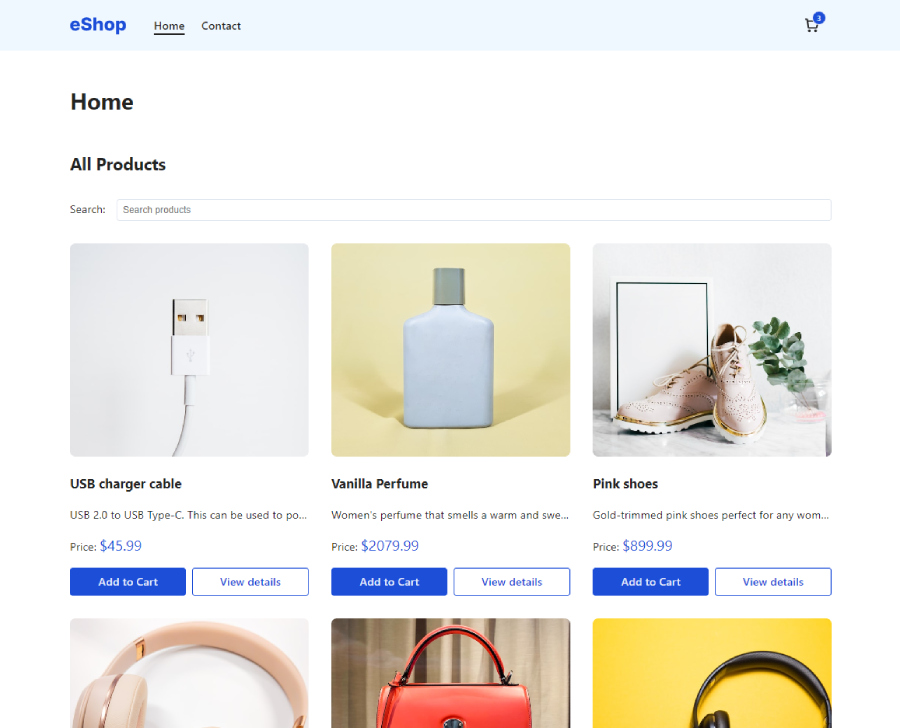
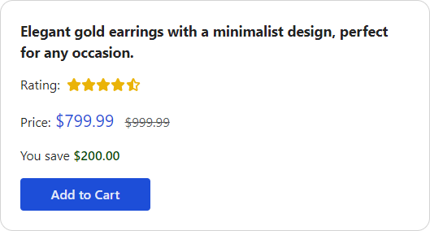
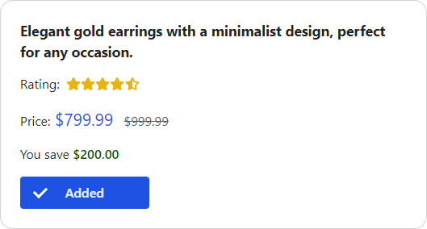
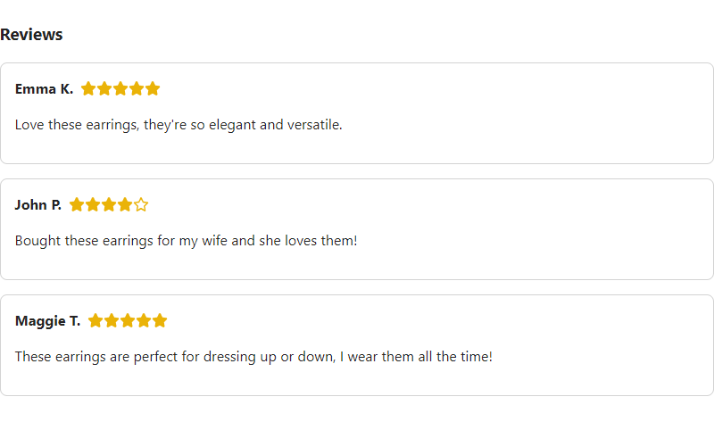
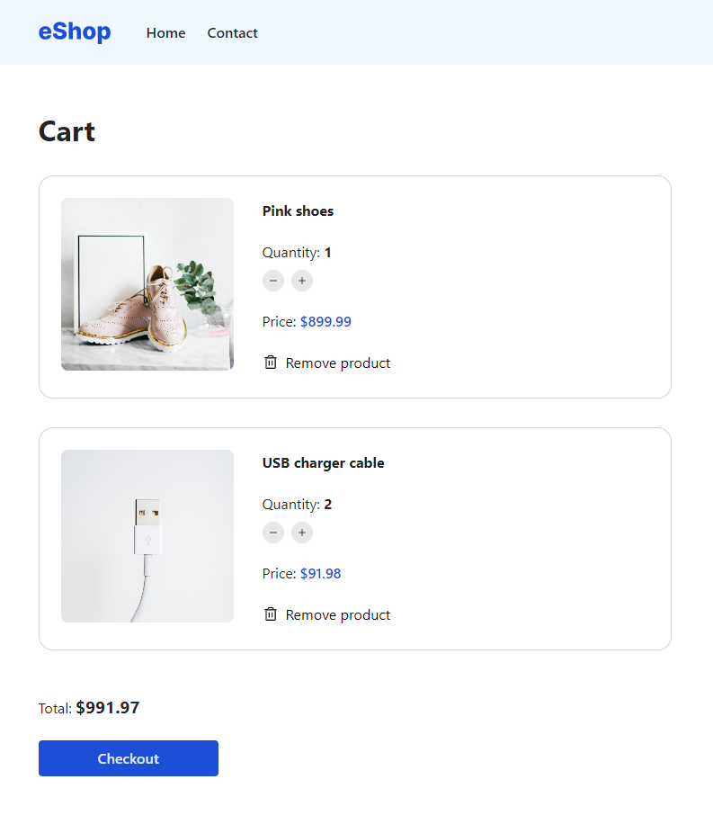

# JavaScript Frameworks Course Assignment

<b>Goal: </b>To apply knowledge of React to build an eCom store.

## Description

Build an online shop in React with these requirements:

- Homepage should list all the products and include a search bar to filter them.
- Use a layout component with header and footer.
- Product details page should display product details and have an Add to Cart button which adds the product to the cart.
- Cart icon component in the header should display the number of items in the Cart with an overlay.
- Cart page should list all the products in the cart and the total price. Clicking checkout button should clear the cart and redirect to the Checkout success page.
- Contact page with form validation. Valid email, minimum of 3 characters and required attribute.
- Use React Router to switch between pages.
- Responsive design.

## Screenshots







## Built With

- [Vite](https://vitejs.dev/)
- [React](https://reactjs.org/)
- Sass

## Getting Started

### Installing

1. Clone the repo:

```bash
git clone git@github.com:baresi687/js-frameworks-ca.git
```

2. Install the dependencies:

```
npm install
```

### Running

To run the app, run the following commands:

```bash
npm run build
npm run preview
```

## Deployed site

[eShop](https://js-frameworks-ca-hreinn.vercel.app/)

## Contact

[My LinkedIn page](https://www.linkedin.com/in/hreinn-gylfason-b9a48521a/)
